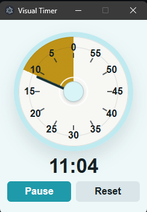

# TimeTimer

A small always-on-top visual timer built with Electron.



## Features

- Visual dial controlled by dragging
- Countdown up to 4 hours
- Always-on-top compact window
- Pause and reset controls
- Alarm beeps when the timer finishes

## Run the app

Install dependencies:

```bash
npm install
```

Start the app:

```bash
npm start
```

## Build

Create a portable Windows `.exe` for launching the app without a terminal:

```bash
npm run build
```

The built app is saved as:

```text
dist/TimeTimer 1.0.0.exe
```
